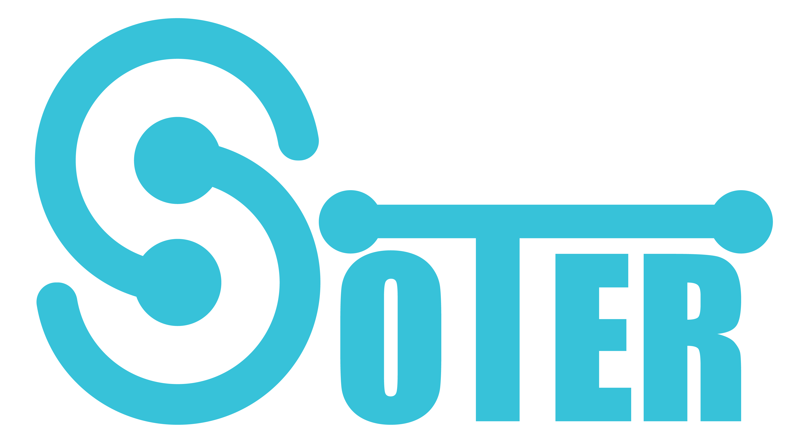
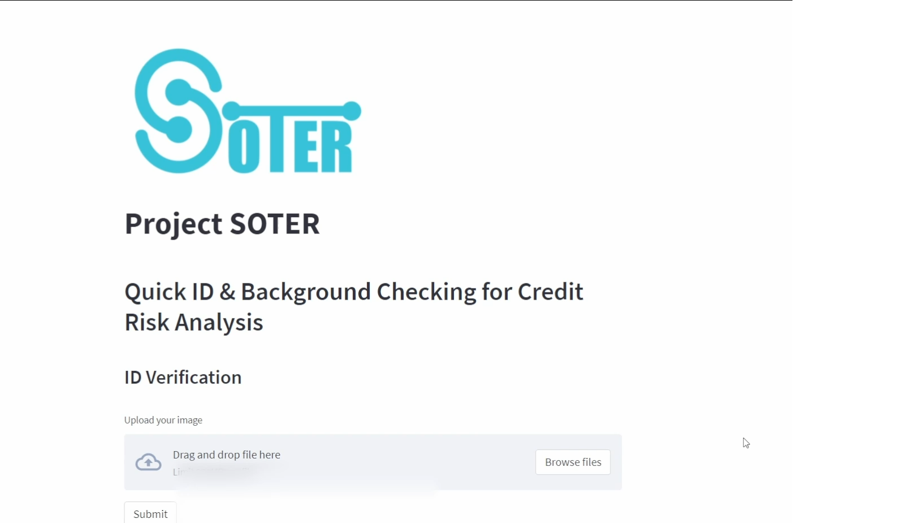
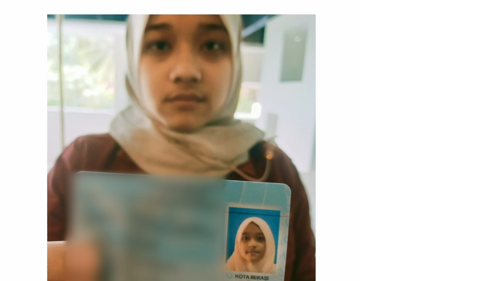
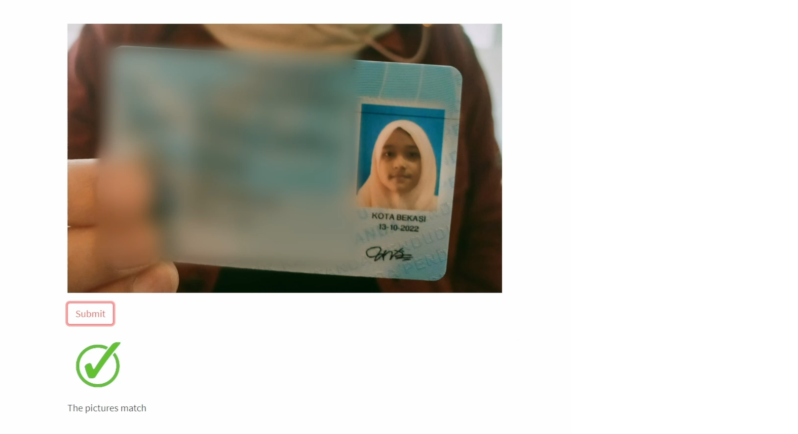
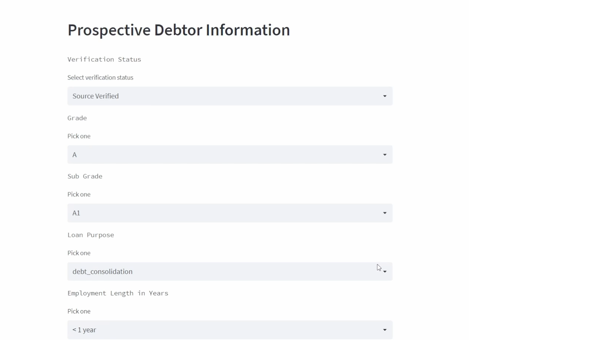
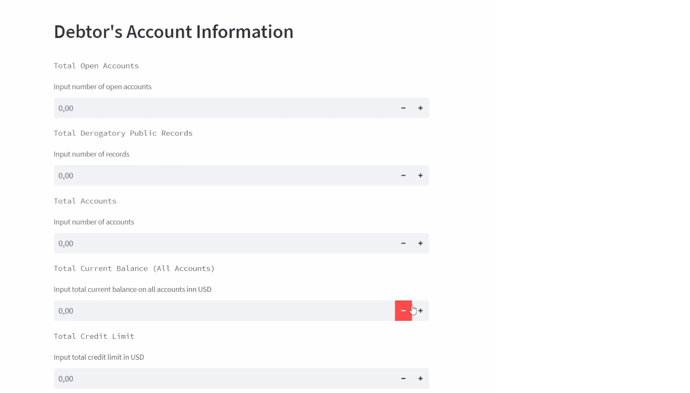
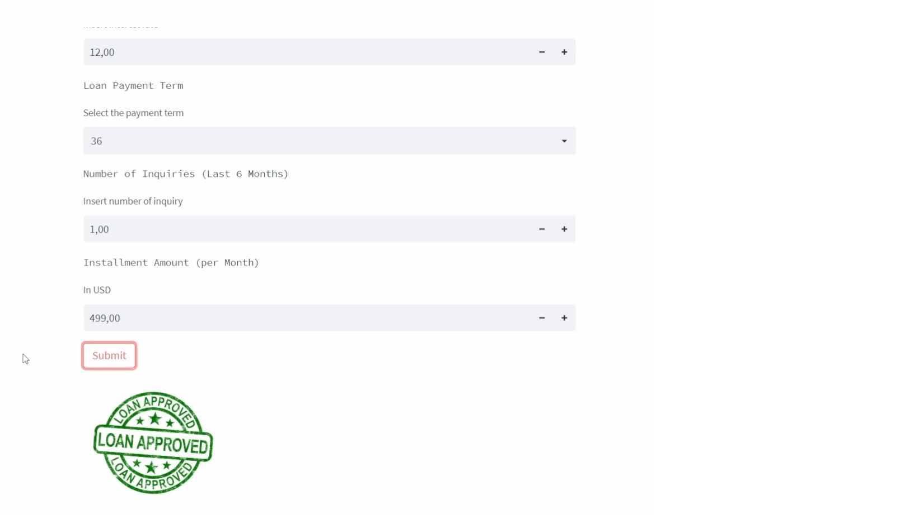

# Soter

  

**Soter** adalah suatu sistem yang akan mampu mempercepat proses penentuan diterima atau ditolaknya pinjaman serta meningkatkan efisiensi review pengajuan pinjaman dengan algoritma machine learning dan deep learning.

## Latar Belakang 

Menurut survei statistik fintech lending oleh OJK dan Survei Perbankan oleh BI, industri finansial dan perbankan memiliki trend pengajuan pinjaman yang terus meningkat. 

Masalahnya adalah proses review penetuan diterima atau ditolaknya suatu pinjaman sangat lama berkisar 4-14 hari. Mayoritas industri menggunakan masih menggunakan review manual. Sehingga cost analisis resiko masih tinggi.

Project soter menawarkan sebuah sistem yang akan mampu mempercepat proses penentuan diterima atau ditolaknya pinjaman serta meningkatkan efisiensi review pengajuan pinjaman dengan algoritma machine learning dan deep learning. sehingga kita dapat menghindari meloloskan calon debitur bermasalah yang dapat menjadi potensi yang merugikan industri.

## Objective

Dari penjelasan sebelumnya, kami kemudia menentukan tujuan dan pemecahan masalahnya meliputi :

1. Membuat sistem yang dapat mendeteksi wajah yang tertera di ID card dengan aslinya.
2. Membuat model yang dapat menentukan calon peminjam layak atau tidak diberi pinjaman. 

## Cara Menggunakan Aplikasi
1. Face Recognation

  
  

  Tampilan dari laman beranda face recognation.

---

Untuk menggunakannya cukup mudah dengan mengupload foto anda dengan menggunakan ktp anda. Kemudian 'Submit', tunggu beberapa saat hingga proses selesai.

  
  

  Tampilan dari hasil foto yang diupload.

---

  
  

  Tampilan dari Hasil yang diperoleh oleh sistem.

Jika foto wajah dengan foto KTP match maka sistem akan memberikan respon ceklis di ikuti dengan tulisan The Picture Match.

---

2. Background Checking

  
  

  Tampilan dari laman beranda background checking.

---

Aplikasi ini berupa form yang harus diisi oleh calon peminjam, form ini bertujuan untuk mengecek latar belakang dari calon peminjam.  
Jika setelah dilakukan background checikng dari calon peminjam hasilnya baik maka usulan peminjamannya akan diterima.

  
  

  Tampilan form yang harus diisi.

---

  
  

  Tampilan jika form yang diisi disetujui.

## Slides Presentation
[Slides](https://www.canva.com/design/DAFP8UoiroU/BZ6iGA-bn2sNB1cnbJzz9A/edit?utm_content=DAFP8UoiroU&utm_campaign=designshare&utm_medium=link2&utm_source=sharebutton)

## Contributor
1. [Daniel Satria](https://github.com/daniel-satria)
2. [Prabaningrum Hendraswari B.](https://github.com/Prabaningrum)
3. [Radyatra Sidharta](https://github.com/Radyatra)
4. [Titian F. Prasasti](https://github.com/titianprasasti)
5. [Ronaldo Syahputra](https://github.com/iOdlanor)
